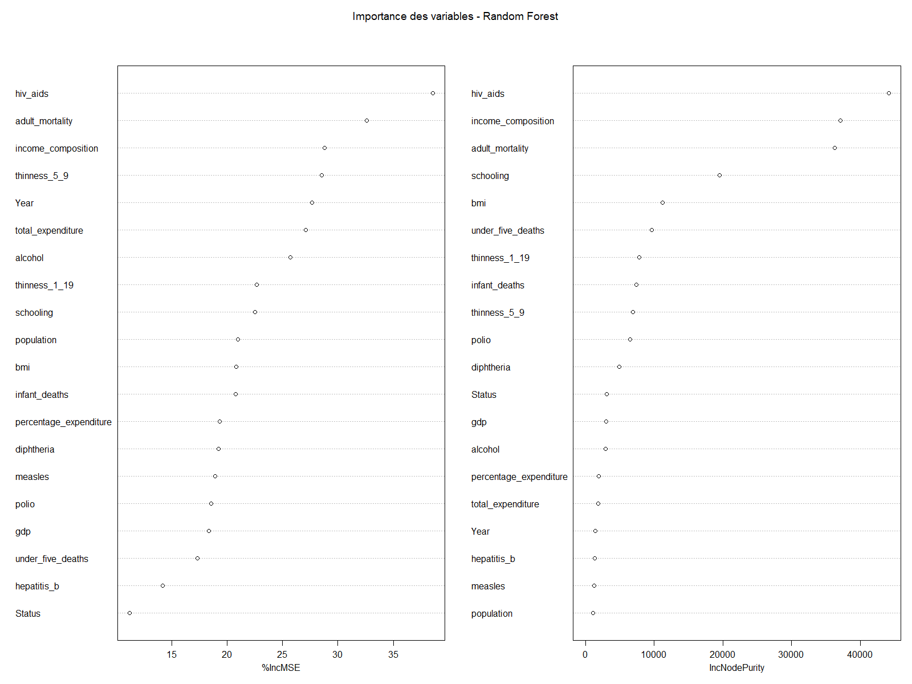
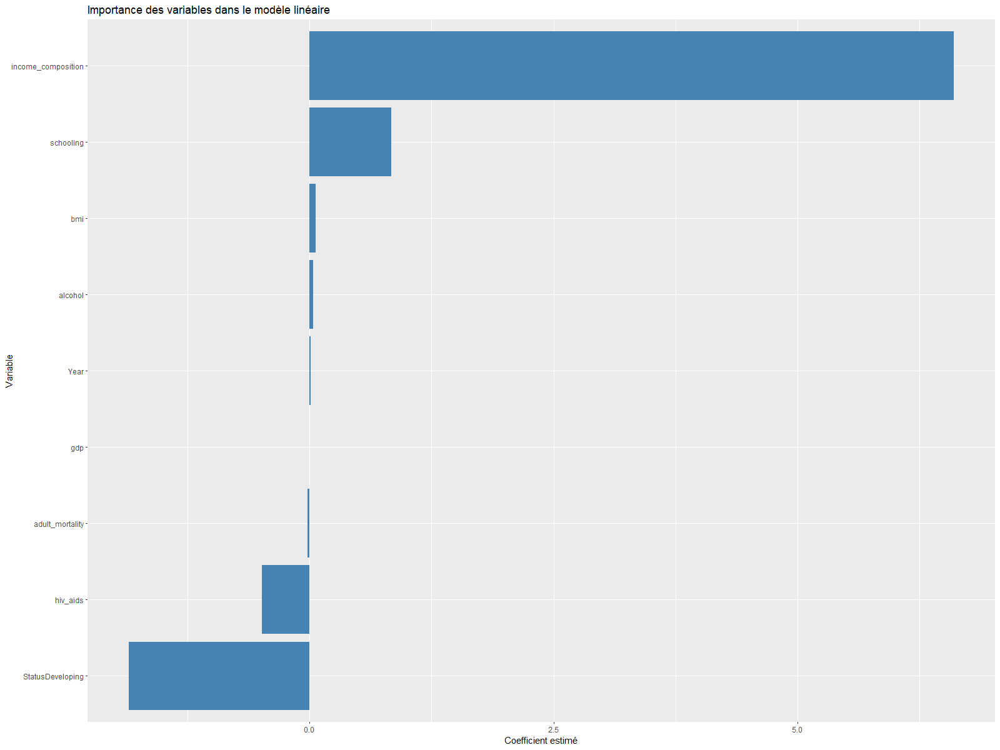

# Analyse de l'espérance de vie (2000–2015)

Ce projet analyse les déterminants de l’espérance de vie dans le monde à partir des données de l’Organisation Mondiale de la Santé (OMS) pour la période **2000–2015**.  
L’objectif est double :

1. construire une **pipeline reproductible** (via `Makefile`) allant de la donnée brute au rapport final
2. comparer plusieurs **modèles prédictifs** (régression linéaire, LASSO, Stepwise, Random Forest) et interpréter les variables les plus explicatives

---

## 1. Données et préparation

### 1.1 Source des données

- Fichier : `data/Life Expectancy Data.csv`  
- Unité d’observation : **pays-année** (par ex. Mali–2007)
- Quelques variables clés :  
  - `Life expectancy` : espérance de vie à la naissance (en années)  
  - `Adult Mortality` : mortalité adulte (nombre de décès pour 1000 adultes)
  - `Alcohol` : consommation d’alcool par habitant 
  - `BMI` : indice de masse corporelle moyen
  - `HIV/AIDS` : mortalité liée au VIH/SIDA
  - `GDP` : produit intérieur brut par habitant 
  - `Schooling` : nombre moyen d’années de scolarisation  
  - `Status` : *Developed* / *Developing*

Ces variables sont ensuite renommées en `snake_case` dans le script pour faciliter la manipulation (`life_expectancy`, `adult_mortality`, `income_composition`, etc.)

### 1.2 Étapes de nettoyage (script `scripts/01_import_cleaning.R`)

Le script effectue les opérations suivantes :

1. **Importation** du CSV avec `readr::read_csv`
2. **Typage** des variables :  
   - `Country`, `Status` en facteurs
   - `Year` en entier 
   - le reste en numérique 
3. **Renommage propre** des colonnes avec les backticks pour gérer espaces et `/` 
4. **Analyse des valeurs manquantes** avec `naniar::miss_var_summary` et visualisation (`vis_miss`) 
5. **Filtrage des NA** sur la variable cible `life_expectancy`
6. **Imputation médiane** sur toutes les autres variables numériques

Le dataset nettoyé est ensuite utilisé pour l’analyse exploratoire et la modélisation, et certaines sorties (modèles, métriques) sont sauvegardées dans `outputs/`

---

## 2. Analyse exploratoire

Toutes les étapes suivantes sont reproduites dans le rapport RMarkdown `rapport_final.Rmd`

### 2.1 Statistiques descriptives globales

- Calcul des résumés (`summary`) sur l’ensemble des variables
- Les premières statistiques montrent :  
  - `life_expectancy` compris entre **36,3** et **89** ans 
  - Forte dispersion sur `GDP` et `population` (pays pauvres vs riches, petits vs très grands) 
  - Présence de valeurs extrêmes sur `measles`, `infant_deaths`, etc.

### 2.2 Corrélations entre variables

Une matrice de corrélation est calculée sur toutes les variables numériques puis visualisée avec `corrplot`

**Figure 1 – Corrélogramme des variables numériques**  


Interprétation :
> Le graphique met en évidence les corrélations positives (bleu) ou négatives (rouge) entre les variables quantitatives du jeu de données.  
> On observe notamment :  
- une forte corrélation positive entre *schooling* et *life_expectancy*  
- une corrélation négative entre *hiv_aids* et *life_expectancy*  
- des liens structurels entre *income_composition*, *gdp*, *bmi* et la santé globale

- Corrélations **positives** fortes avec `life_expectancy` :  
  - `schooling`  
  - `income_composition`  
  - `bmi`  
- Corrélations **négatives** marquées :  
  - `adult_mortality`  
  - `hiv_aids`  
  - `infant_deaths`  

Ces patterns confirment les liens attendus entre conditions socio-économiques, santé publique et espérance de vie.

### 2.3 Distribution de l’espérance de vie

Un histogramme de `life_expectancy` est tracé avec `ggplot2`.

**Figure 2 – Histogramme de l’espérance de vie**  


Points clés :

- La distribution est centrée autour de **70 ans**
- Une queue à gauche montre que plusieurs pays/années restent sous les **50 ans**, souvent en situation de fragilité sanitaire
- Une queue à droite indique que les pays développés dépassent régulièrement les **80 ans**


### 2.4 Relation entre mortalité adulte et espérance de vie

Nuage de points `adult_mortality` vs `life_expectancy`.

**Figure 3 – Espérance de vie vs mortalité adulte**  


Interprétation :

- Relation **fortement décroissante** : plus la mortalité adulte est élevée, plus l’espérance de vie chute
- Le nuage dense avec une pente négative claire → `adult_mortality` est un **driver majeur** de la variable cible

### 2.5 Espérance de vie selon le statut de développement

Boxplot de `life_expectancy` par `Status`.

**Figure 4 – Boxplots de l’espérance de vie par statut de développement**   


Interprétation :

- Les pays `Developed` ont une espérance de vie **nettement plus élevée** en médiane.  
- Les pays `Developing` présentent une **dispersion plus forte**, signe d’inégalités internes importantes.  

### 2.6 Lien entre PIB et espérance de vie (échelle log)

Scatterplot `gdp` vs `life_expectancy` avec une échelle logarithmique sur l’axe des x.

**Figure 5 – Espérance de vie vs PIB (log10)**  


**Interprétation :**

- **Montée rapide de l’espérance de vie** lorsque l’on passe de très faibles à moyens niveaux de PIB
- **Effet marginal décroissant** : au-delà d’un niveau économique intermédiaire, augmenter le PIB n’améliore qu’assez peu l’espérance de vie  
- Ce comportement correspond à la **courbe de Preston**, bien connue en économie de la santé :  
  -> Les gains en santé sont énormes pour les pays pauvres, puis se stabilisent pour les pays riches.

---

## 3. Modélisation

Les modèles sont estimés après nettoyage complet et séparation **train/test** (80 % / 20 %).  
Variable cible : `life_expectancy`.

### 3.1 Création des échantillons

- `set.seed(123)` pour la reproductibilité.  
- `train` : 80 % des lignes.  
- `test`  : 20 % restantes.  

Deux métriques sont utilisées :

- **RMSE** : erreur quadratique moyenne.  
- **R²** : part de variance expliquée.

### 3.2 Modèle de régression linéaire multiple

Formule retenue :

- `life_expectancy ~ adult_mortality + gdp + schooling + income_composition + hiv_aids + bmi + alcohol + Status + Year`

Résultats principaux :

- R² ajusté autour de **0,78**.  
- Coefficients significatifs (p-value très faible) pour :  
  - `adult_mortality` (effet négatif)  
  - `gdp` (positif)  
  - `schooling` (positif)  
  - `income_composition` (positif)  
  - `hiv_aids` (fortement négatif)  
  - `bmi` (positif)  
  - `StatusDeveloping` (effet négatif par rapport à *Developed*).  

Le modèle sert de **baseline interprétable**.

### 3.3 Sélection de variables – Stepwise AIC

À partir du modèle complet, une procédure **Stepwise AIC** (avant/arrière) est appliquée :

- Utilisation de `MASS::stepAIC` 
- Le modèle final conserve les mêmes grandes variables explicatives (`adult_mortality`, `gdp`, `schooling`, `income_composition` `hiv_aids`, `bmi`, `Status`).  
- Les performances (RMSE, R²) sont très proches du modèle linéaire initial.

### 3.4 Régression LASSO (glmnet)

- Construction de `X_train`, `X_test` via `model.matrix`  
- Cross-validation avec `cv.glmnet` pour choisir `lambda.min`
- Le LASSO sélectionne automatiquement les variables les plus pertinentes :  
  - Gardées : `adult_mortality`, `gdp`, `schooling`, `income_composition`, `hiv_aids`, `bmi`, `alcohol`, `Status` 
  - Pratiquement aucun gain de performance par rapport au modèle linéaire simple, mais **meilleure robustesse** face à la colinéarité.

### 3.5 Random Forest

- Données : mêmes features que précédemment, mais sans `Country` 
- Paramètres : `ntree = 500`, `mtry = 4`
- Importance des variables évaluée via les indicateurs du Random Forest (`%IncMSE` et `IncNodePurity`)

**Figure 6 – Importance des variables (Random Forest, %IncMSE et IncNodePurity)**  


Interprétation :

- Le modèle Random Forest met fortement en avant :  
  - **hiv_aids** : variable la plus importante -> les épidémies et maladies infectieuses influencent massivement l'espérance de vie  
  - **adult_mortality** : confirme qu'une mortalité élevée est un déterminant majeur  
  - **income_composition** : mesure du développement humain ; très lié au niveau socio-économique  
  - **thinness_5_9** et **thinness_1_19** : indicateurs nutritionnels révélant des conditions de santé globales  

- Les variables nutritionnelles et socio-économiques apparaissent plus importantes que le **PIB brut**.

- Le Random Forest détecte des **relations non linéaires** et **interactions complexes**, ce qui explique ses performances supérieures aux modèles linéaires.

---

## 4. Comparaison des modèles

Les performances (valeurs indicatives issues des expériences) sont :

| Modèle              | RMSE Train | RMSE Test | R² Train | R² Test |
|---------------------|-----------:|----------:|---------:|--------:|
| Régression linéaire |    ~4.41   |   ~4.47   | ~0.783   | ~0.786  |
| LASSO               |    ~4.42   |   ~4.47   | ~0.783   | ~0.786  |
| Stepwise            |    ~4.42   |   ~4.48   | ~0.783   | ~0.785  |
| **Random Forest**   |  **0.82**  | **1.91**  | **0.99** | **0.96**|

**Figure 7 – Comparaison graphique des RMSE / R² par modèle**  


**Interprétation :**

Cette visualisation compare quatre modèles :  
- Régression linéaire  
- LASSO  
- Stepwise AIC  
- Random Forest  

**1) Performances RMSE (erreur)**  
- Les trois modèles *linéaires* affichent des RMSE très proches (~4.4) 
- Le **Random Forest** surpasse de loin les autres avec un RMSE Test ≈ **1.9**, soit une réduction très importante de l’erreur

**2) Performances R² (variance expliquée)**  
- Les modèles linéaires expliquent environ **78 %** de la variance de `life_expectancy`  
- Le Random Forest atteint **96 %**, révélant un pouvoir prédictif nettement supérieur

**3) Conclusion**  
- Les modèles linéaires sont fiables, cohérents et interprétables mais limités
- Le **Random Forest** capte des non-linéarités et interactions complexes -> il offre les **meilleures performances globales**

---

## 5. Importance des variables

### 5.1 Modèle linéaire

Les coefficients (en valeur absolue) montrent que les principales variables sont :

1. `income_composition` (effet positif massif)  
2. `schooling`  
3. `hiv_aids` (effet négatif très important)  
4. `adult_mortality` (effet négatif)  
5. `StatusDeveloping` (pénalité pour les pays en développement)  

**Figure 8 – Top 10 coefficients du modèle linéaire (barplot)**  


### Interprétation :

Le modèle linéaire permet d’identifier les facteurs expliquant *le plus fortement* l’espérance de vie en se basant sur la **valeur absolue des coefficients estimés**.

Les variables majeures observées ici sont :

1. **income_composition** – Effet **positif massif** : c’est la variable la plus explicative
2. **schooling** – Effet positif important : l’éducation est un déterminant clé du niveau de santé
3. **hiv_aids** – Effet **négatif très marqué**, confirmant l’impact dramatique du VIH sur la durée de vie
4. **adult_mortality** – Effet négatif significatif : plus la mortalité adulte est élevée, plus l’espérance de vie baisse
5. **StatusDeveloping** – Coefficient négatif indiquant une pénalité structurelle pour les pays en développement

En résumé :  
Les variables socio-économiques (revenu, éducation) et sanitaires (VIH, mortalité) dominent très largement le modèle linéaire.  

### 5.2 Random Forest

Les variables les plus importantes selon `%IncMSE` (voir **Figure 6**) incluent :

1. `hiv_aids`  
2. `adult_mortality`  
3. `income_composition`  
4. `thinness_5_9`  
5. `Year`  
6. `total_expenditure`  
7. `alcohol`  
8. `thinness_1_19`  
9. `schooling`  
10. `population`  

**Interprétation :**

- `hiv_aids` et `adult_mortality` ressortent comme les variables les plus déterminantes pour expliquer l’espérance de vie 
- `income_composition` (indice de développement humain) arrive aussi très haut : lien clair entre conditions socio-économiques et santé
- Les indicateurs nutritionnels (`thinness_5_9`, `thinness_1_19`) apparaissent plus importants que dans le modèle linéaire
- Le Random Forest capture des effets complexes et non linéaires, d’où un classement parfois différent du modèle linéaire

---

## 6. Pipeline reproductible (Makefile)

Le projet est orchestré par un `Makefile` qui assemble toutes les étapes :

1. **Nettoyage + modélisation** :  
   - Script : `scripts/01_import_cleaning.R`  
   - Entrée : `data/Life Expectancy Data.csv`  
   - Sorties (dans `outputs/`) :  
     - données nettoyées (ex. `life_expectancy_clean.csv`),  
     - objets modèles (`.rds` éventuels),  
     - tableaux de métriques.  

2. **Génération du rapport** :  
   - Script : `scripts/02_generate_report.R`  
   - Appelle `rmarkdown::render("rapport_final.Rmd", ...)`.  
   - Produit le fichier Word final : `outputs/rapport_final.docx`.

Commandes principales :

```bash
make        # exécute 01_import_cleaning.R puis 02_generate_report.R
make clean  # supprime les outputs générés et fichiers intermédiaires
```

---

## 7. Structure du projet

```text
analyse-esperance-de-vie/
│
├── data/                                  # Données brutes du projet
│   └── Life Expectancy Data.csv           # Données OMS (2000–2015)
│
├── outputs/                               # Tous les fichiers produits automatiquement
│   ├── life_expectancy_clean.csv          # Données nettoyées et imputées
│   ├── modele_* / métriques_*             # Objets R sauvegardés (.rds), tableaux de scores
│   └── rapport_final.docx                 # Rapport Word généré via RMarkdown
│
├── scripts/                               # Scripts R exécutés par la pipeline Makefile
│   ├── 01_import_cleaning.R               # Nettoyage, préparation des données, modélisation, export
│   └── 02_generate_report.R               # Appel à rmarkdown::render() → génération du rapport final
│
├── figures/                               # Figures exportées depuis R pour le README et les analyses
│   ├── fig01_corrplot.png                 # Corrélogramme variables numériques
│   ├── fig02_hist_life_expectancy.png     # Histogramme de l’espérance de vie
│   ├── fig03_adult_mortality_vs_life.png  # Relation mortalité adulte vs espérance de vie
│   ├── fig04_boxplot_status.png           # Espérance de vie par statut (Developed/Developing)
│   ├── fig05_life_vs_gdp_log.png          # Courbe de Preston (PIB log10 vs espérance de vie)
│   ├── fig06_importance_random_forest.png # Importance des variables — Random Forest
│   ├── fig07_compare_models.png           # Comparaison RMSE/R² des modèles
│   └── fig08_importance_lm.png            # Importance (coefficients) du modèle linéaire
│
├── rapport_final.Rmd                      # Rapport complet (analyse + figures + résultats + conclusion)
│
├── Makefile                               # Pipeline automatisée (cleaning → modèles → rapport)
│
└── README.md                              # Documentation complète du projet, analyses, figures, workflow

```

---

## 8. Utilisation rapide

1. Cloner le dépôt :

```bash
git clone <url_du_repo>
cd analyse-esperance-de-vie
```

2. Vérifier que R et les packages nécessaires sont installés.  
3. Lancer la pipeline :

```bash
make
```

4. Ouvrir le rapport Word généré :

```text
outputs/rapport_final.docx
```

5. (Optionnel) Nettoyer les résultats :

```bash
make clean
```

---

## 9. Conclusion générale

- L’espérance de vie est fortement liée :  
  - aux **conditions socio-économiques** (`income_composition`, `schooling`), 
  - à la **mortalité adulte** et aux **maladies infectieuses** (`hiv_aids`, `infant_deaths`),  
  - au **niveau de développement** (`Status`).  
- Les modèles linéaires offrent une lecture claire des effets marginaux, mais le **Random Forest** fournit la meilleure précision prédictive.  
- La mise en place d’un **workflow entièrement reproductible** (Makefile + scripts + RMarkdown) permet de rejouer facilement toute l’analyse en cas de mise à jour des données ou d’extension du projet.

---

## 10. Contact

Pour toute question ou suggestion d’amélioration : *Mohamed Lamine OULD BOUYA*  
Dépôt GitHub : `analyse-esperance-de-vie`
